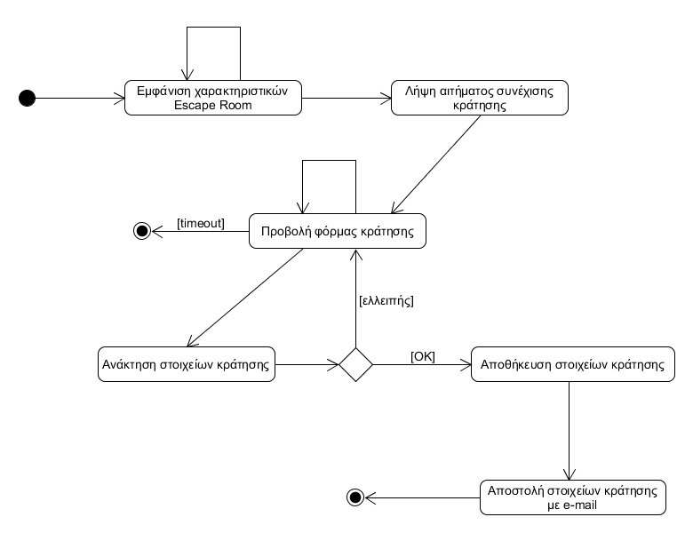
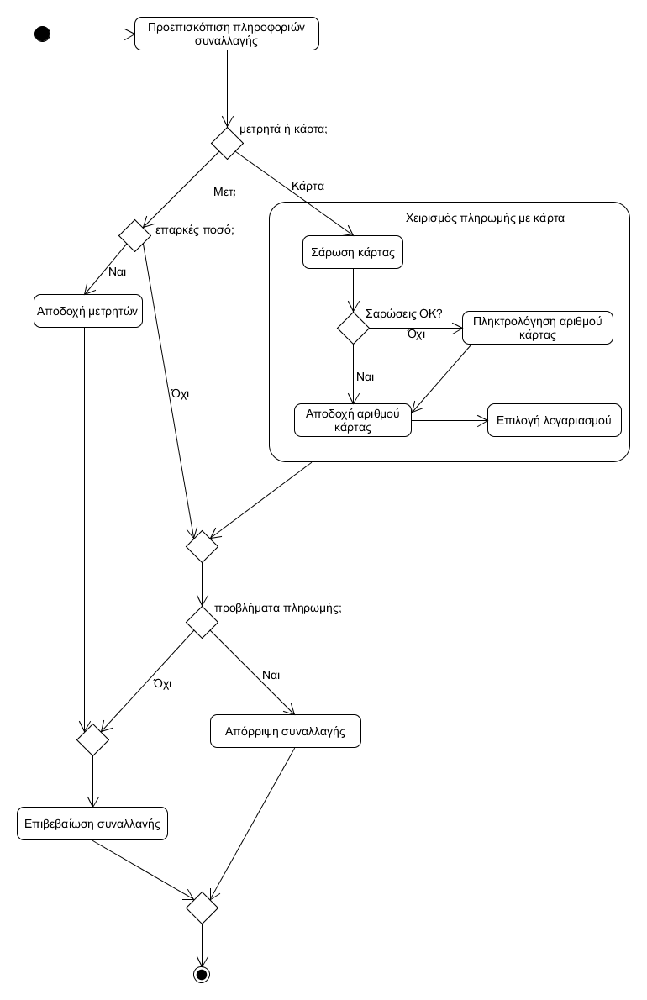
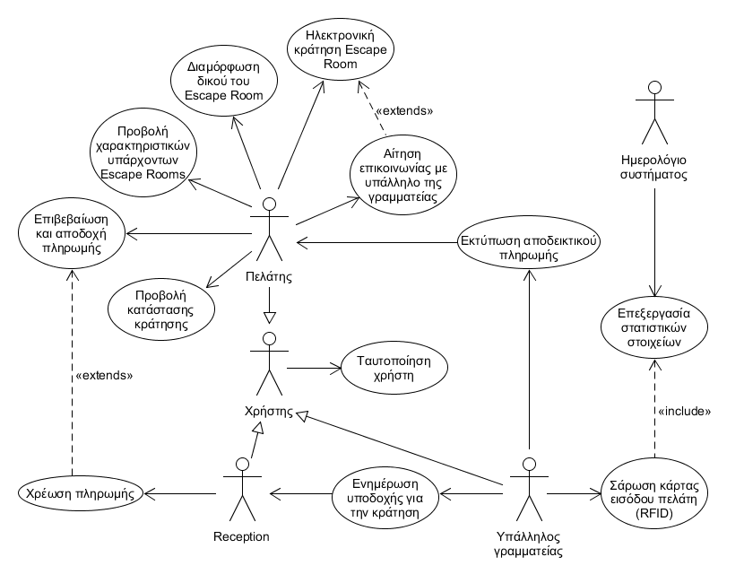
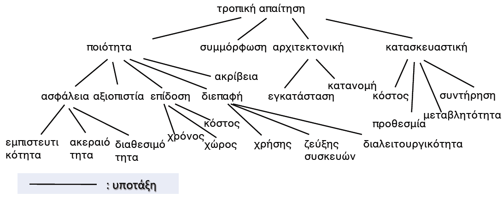
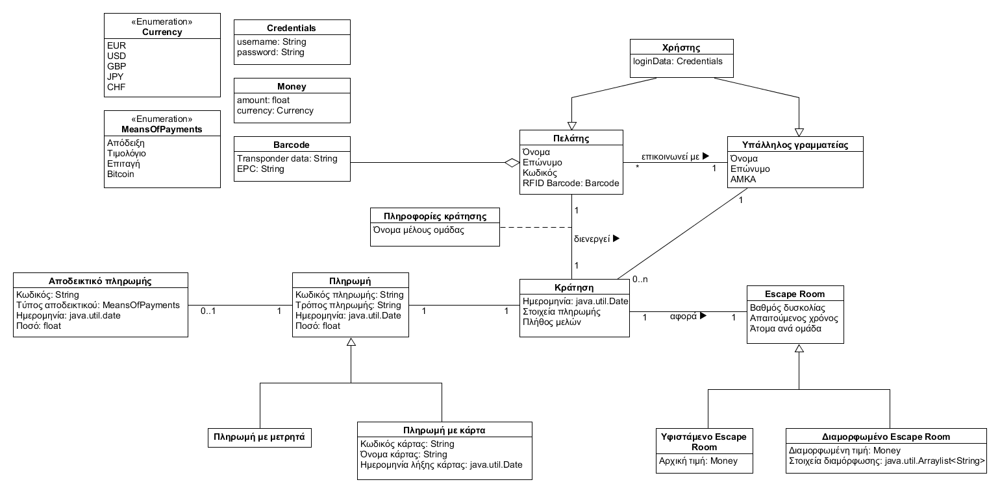
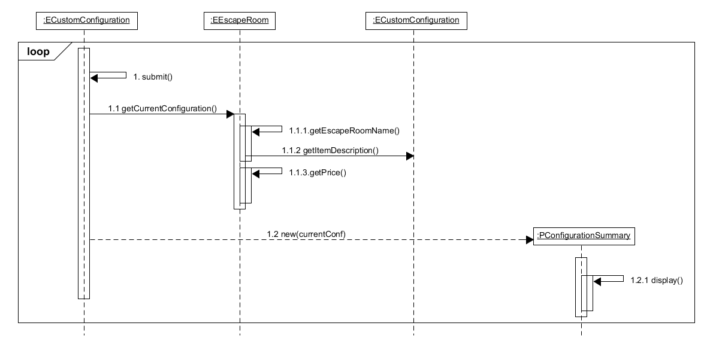
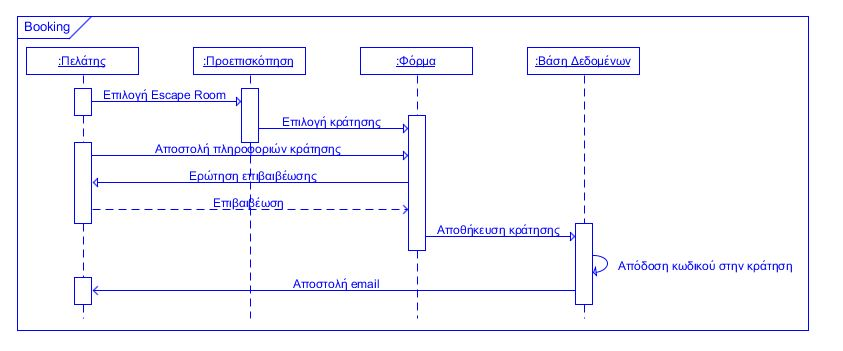

Σύστημα διαχείρισης κρατήσεων Escape Rooms
=======

## R.2. Απαιτήσεις λογισμικού/Ανάλυση συστήματος

### R.2.1 Μοντέλο περιπτώσεων χρήσης

#### ΠΧ1. Απαιτήσεις λογισμικού/Ανάλυση συστήματος

##### 	Πρωτεύων Actor:
Πελάτης

##### 	Ενδιαφερόμενοι (Stakeholders):
–	Πελάτης: Θέλει να επιλέγει τα διάφορα υπάρχοντα Escape Rooms και να επισκοπεί συνοπτικά και αναλυτικά τα χαρακτηριστικά τους (βαθμός δυσκολίας, απαιτούμενος χρόνος, άτομα ανά ομάδα κ.λπ.) και την τιμή.

–	Διευθυντής πωλήσεων: Θέλει να προσελκύσει νέους πελάτες στα Escape Rooms.

##### 	Προϋποθέσεις:
Ο πελάτης έχει εκτελέσει με επιτυχία την περίπτωση χρήσης «Ταυτοποίηση χρήστη».

##### 	Βασική ροή γεγονότων:
1.	Ο πελάτης επιλέγει να προβάλλει τα χαρακτηριστικά ενός υφιστάμενου Escape Room, επιλέγοντας «περισσότερα» κατόπιν επισκόπισης όλων των υπάρχοντων Escape Rooms στην αρχική οθόνη.
2.	Το σύστημα εμφανίζει στον πελάτη τα συνοπτικά χαρακτηριστικά του Escape Room που έχει επιλέξει, την κεντρική φωτογραφία, καθώς και κομβίο προτροπής για την εμφάνιση περισσότερων πληροφοριών.
3.	Ο πελάτης επιλέγει «περισσότερα» για την εμφάνιση αναλυτικών πληροφοριών.
4.	Το σύστημα προβάλλει τις αναλυτικές πληροφορίες και λεπτομέρειες για τα χαρακτηριστικά του Escape Room, καθώς και το σύνολο των φωτογραφιών. Στο κάτω μέρος πια, βρίσκεται το κομβίο προτροπής «κράτησης».

##### 	Εναλλακτικές ροές:
(*) Σε οποιοδήποτε σημείο το λογισμικό καταρρέει.
1.	Ο πελάτης επαναφορτώνει τη σελίδα προεπισκόπισης των Escape Rooms.

       1α. Ο web server δεν ανταποκρίνεται στο αίτημα επαναφόρτωσης.
       
       1. Η περίπτωση χρήσης τερματίζει.
2.	Η περίπτωση χρήσης επανεκκινείται, επιστρέφοντας στο βήμα 1.

#### ΠΧ2. Διαμόρφωση δικού του Escape Room

##### 	Πρωτεύων Actor:
 Πελάτης

##### 	Ενδιαφερόμενοι (Stakeholders):
–	Πελάτης: Θέλει να διαμορφώνει τα υπάρχοντα Escape Rooms ή να δημιουργεί εξ’ολοκλήρου νέα, που να πληρούν πρόσθετα χαρακτηριστικά ή να τροποποιούν κατάλληλα εκείνα των υπαρχόντων.

–	Διευθυντής κρατήσεων: Θέλει να εξασφαλίσει τη κατάλληλη διαμόρφωση των Escape Rooms, ώστε να πληρούν τις αναθεωρημένες προδιαγραφές και να εξασφαλίζουν όσα ζήτησε ο πελάτης.

–	Διευθυντής πωλήσεων: Θέλει να προσελκύσει νέους πελάτες στα Escape Rooms.

##### 	Προϋποθέσεις:
Ο πελάτης έχει εκτελέσει με επιτυχία τις περιπτώσεις χρήσης «Ταυτοποίηση χρήστη» και «Προβολή χαρακτηριστικών υπάρχοντων Escape Rooms».

##### 	Βασική ροή γεγονότων:
1.	Ο πελάτης επιλέγει να διαμορφώσει το δικό του Escape Room, επιλέγοντας «διαμόρφωση» κατόπιν εμφάνισης των χαρακτηριστικών του Escape Room στην οθόνη ή στη σελίδα προεπισκόπησης των Escape Rooms.
2.	Το σύστημα ζητάει από τον πελάτη να εισάγει τις παρατηρήσεις του σε φυσική γλώσσα (π.χ. Ελληνικά) και να τροποποιήσει/αποεπιλέξει τα παρεχόμενα χαρακτηριστικά ενός Escape Room σε κατάλληλες γραφικές δομές.
3.	Ο πελάτης επιλέγει «διαμόρφωση» για την επιβεβαίωση των στοιχείων.
4.	Το σύστημα ομαδοποιεί τις λεπτομέρειες διαμόρφωσης σαν χαρακτηριστικά ενός νέου Escape Room, με τα πεδία που δεν τροποποιήθηκαν να παραμένουν αμετάβλητα, και αποθηκεύει τα στοιχεία στη βάση δεδομένων.

##### 	Εναλλακτικές ροές:
(*) Σε οποιοδήποτε σημείο το λογισμικό καταρρέει.
1.	Ο πελάτης επαναφορτώνει τη σελίδα με τη φόρμα διαμόρφωσης Escape Rooms.

      1α. Ο web server δεν ανταποκρίνεται στο αίτημα επαναφόρτωσης.
      
      1. Η περίπτωση χρήσης τερματίζει.
2.	Η περίπτωση χρήσης επανεκκινείται, επιστρέφοντας στο βήμα 1.

3α. Ο πελάτης επιλέγει «διαμόρφωση» δίχως να έχει καταχωρήσει ορισμένα απαιτούμενα στοιχεία.
1.	Το σύστημα εμφανίζει κατάλληλο μήνυμα λάθους και του υποδεικνύει τα πεδία που πρέπει να συμπληρωθούν.
2.	Η περίπτωση χρήσης επιστρέφει στο βήμα 2.

3β. Ο πελάτης επιλέγει «διαμόρφωση», για ένα δεδομένο υπάρχον Escape Room, ενώ τα τροποποιημένα χαρακτηριστικά της διαμόρφωσης είναι ασύμβατα με τα χαρακτηριστικά του επιλεγμένου Escape Room.
1.	Το σύστημα εμφανίζει κατάλληλο μήνυμα λάθους και του υποδεικνύει τα πεδία που αποκλίνουν των περιορισμών.
2.	Η περίπτωση χρήσης επιστρέφει στο βήμα 2.

3γ. Ο πελάτης επιλέγει «επαναφορά» για να μεταβεί σε μια άδεια φόρμα διαμόρφωσης.
1.	Το σύστημα επιτρέπει στον πελάτη να πληκτρολογήσει από την αρχή τις απαιτούμενες πληροφορίες.
2.	Η περίπτωση χρήσης επιστρέφει στο βήμα 3.

#### ΠΧ3: Ηλεκτρονική κράτηση Escape Rooms
##### 	Πρωτεύων Actor:
Πελάτης

##### 	Ενδιαφερόμενοι (Stakeholders):
–	Πελάτης: Θέλει να κάνει κράτηση σε ένα δεδομένο Escape Room (υπάρχον ή διαμορφωμένο).

–	Διευθυντής πωλήσεων: Θέλει να προσελκύσει νέους πελάτες στα Escape Rooms.

##### 	Προϋποθέσεις:
Ο πελάτης έχει εκτελέσει με επιτυχία την περίπτωση χρήσης «Ταυτοποίηση χρήστη».

##### 	Βασική ροή γεγονότων:
1.	Ο πελάτης επιλέγει να κάνει κράτηση στο Escape Room, επιλέγοντας «συνέχεια» κατόπιν εμφάνισης των χαρακτηριστικών του Escape Room στην οθόνη.

    [Σημείο Επέκτασης Ε1: Κράτηση κατόπιν συνεννόησης]
2.	Το σύστημα ζητάει από τον πελάτη να καταχωρήσει τα στοιχεία της κράτησης όπως το όνομα του υπαλλήλου της γραμματείας (εάν είναι γνωστό), το όνομα του αρχηγού της ομάδας, τα υπόλοιπα μέλη, τα στοιχεία τιμολόγησης, τη μέθοδο πληρωμής (πιστωτική κάρτα ή επιταγή).
3.	Ο πελάτης επιλέγει «κράτηση» για την επιβεβαίωση της κράτησης.
4.	Το σύστημα δίνει ένα μοναδικό κωδικό στην κράτηση και αποθηκεύει τα στοιχεία της κράτησης στη βάση δεδομένων.
5.	Το σύστημα στέλνει στον πελάτη μέσω e-mail τον κωδικό του, τον κωδικό της κράτησης καθώς επίσης και τα υπόλοιπα στοιχεία της κράτησης (χαρακτηριστικά του Escape Room, στοιχεία πληρωμής, τιμή, όνομα αρχηγού και μελών ομάδας) ως αποδεικτικά στοιχεία αποδοχής της.

##### 	Εναλλακτικές ροές:
(*) Σε οποιοδήποτε σημείο το λογισμικό καταρρέει.
1.	Ο πελάτης επαναφορτώνει τη σελίδα κράτησης Escape Rooms.

    1α. Ο web server δεν ανταποκρίνεται στο αίτημα επαναφόρτωσης.
    1. Η περίπτωση χρήσης τερματίζει.
2.	Η περίπτωση χρήσης επανεκκινείται, επιστρέφοντας στο βήμα 1.

3α. Ο πελάτης επιλέγει «κράτηση» δίχως να έχει καταχωρήσει όλα τα απαιτούμενα στοιχεία.
1.	Το σύστημα εμφανίζει κατάλληλο μήνυμα λάθους και του υποδεικνύει τα πεδία που πρέπει να συμπληρωθούν.
2.	Η περίπτωση χρήσης επιστρέφει στο βήμα 2.

3β. Ο πελάτης επιλέγει «κράτηση» ενώ τα συμπληρωθέντα στοιχεία δεν είναι σύμφωνα με τα χαρακτηριστικά του επιλεγμένου Escape Room.
1.	Το σύστημα εμφανίζει κατάλληλο μήνυμα λάθους και του υποδεικνύει τα πεδία που αποκλίνουν των περιορισμών.
2.	Η περίπτωση χρήσης επιστρέφει στο βήμα 2.

3γ. Ο πελάτης επιλέγει «επαναφορά» για να μεταβεί σε μια άδεια φόρμα κράτησης.
1.	Το σύστημα επιτρέπει στον πελάτη να πληκτρολογήσει από την αρχή τις απαιτούμενες πληροφορίες.
2.	Η περίπτωση χρήσης επιστρέφει στο βήμα 3.

3δ. Παρέρχεται ο μέγιστος χρόνος παραμονής στη σελίδα για τη συμπλήρωση της φόρμας.
1.	Το σύστημα εμφανίζει κατάλληλο μήνυμα παρέλευσης του μέγιστου επιτρεπόμενου χρόνου.
2.	Η περίπτωση χρήσης τερματίζει.

##### 	Μετασυνθήκες:
–	Αν η μελέτη περίπτωσης ολοκληρωθεί με επιτυχία, η κράτηση καταχωρείται στη βάση δεδομένων.

–	Σε κάθε άλλη περίπτωση, η κατάσταση του συστήματος παραμένει αμετάβλητη.

#### ΠΧ4: Αίτηση επικοινωνίας με υπάλληλο της γραμματείας

##### 	Πρωτεύων Actor:
Πελάτης

##### 	Ενδιαφερόμενοι (Stakeholders):
–	Πελάτης: Θέλει να διαμορφώνει τα υπάρχοντα Escape Rooms ή να δημιουργεί εξ’ολοκλήρου νέα, που να πληρούν πρόσθετα χαρακτηριστικά ή να τροποποιούν κατάλληλα εκείνα των υπαρχόντων.

–	Υπάλληλος γραμματείας: Θέλει να εξασφαλίσει βέλτιστη προώθηση των Escape Rooms, αναλυτικότερη πληροφόρηση για τον πελάτη, καθώς και μεγιστοποίηση των κρατήσεων που αναλαμβάνει ο ίδιος.

–	Διευθυντής πωλήσεων: Θέλει να προσελκύσει νέους πελάτες στα Escape Rooms.

##### 	Συνθήκη:
Ο πελάτης επιθυμεί να επικοινωνήσει με έναν υπάλληλο της γραμματείας για να προσθα-φαιρέσει χαρακτηριστικά ή να τροποποιήσει κατάλληλα εκείνα των υφιστάμενων Escape Rooms, να συζητήσει σχετικά με τις υπάρχουσες επιλογές, καθώς και να διαπραγματευτεί την τιμή.

##### 	Προϋποθέσεις:
Ο πελάτης έχει εκτελέσει με επιτυχία τις περιπτώσεις χρήσης «Ταυτοποίηση χρήστη» και «Προβολή χαρακτηριστικών υπάρχοντων Escape Rooms». Ο υπάλληλος της γραμματείας έχει εκτελέσει με επιτυχία την περίπτωση χρήσης «Ταυτοποίηση χρήστη».

##### 	Σημείο Επέκτασης Ε1: Κράτηση κατόπιν συνεννόησης
1.	Ο πελάτης επιλέγει να αιτηθεί επικοινωνία με έναν υπάλληλο της γραμματείας, για να λάβει βοήθεια στην επιλογή ή τη διαμόρφωση ενός Escape Room, καθώς και να διαπραγματευτεί την τιμή.
2.	Το σύστημα ζητάει από τον πελάτη να εισάγει τα στοιχεία και τις παρατηρήσεις του σε φυσική γλώσσα (π.χ. Ελληνικά), σε κατάλληλα διαμορφωμένη φόρμα αίτησης επικοινωνίας με κάποιον υπάλληλο.
3.	Ο πελάτης επιλέγει «υποβολή αιτήματος επικοινωνίας» για την επιβεβαίωση των εισαχθέντων στοιχείων.
4.	Το σύστημα προωθεί το αίτημα στους υπαλλήλους της γραμματείας και το αποθηκεύει στη βάση δεδομένων.

##### 	Εναλλακτικές ροές σημείου επέκτασης:
(*) Σε οποιοδήποτε σημείο το λογισμικό καταρρέει.
1.	Ο πελάτης επαναφορτώνει τη σελίδα με τη φόρμα επικοινωνίας.

    1α. Ο web server δεν ανταποκρίνεται στο αίτημα επαναφόρτωσης.
     1. Η περίπτωση χρήσης τερματίζει.

2.	Η περίπτωση χρήσης επανεκκινείται, επιστρέφοντας στο βήμα 1.

3α. Ο πελάτης επιλέγει «υποβολή αιτήματος επικοινωνίας» δίχως να έχει καταχωρήσει όλα τα απαιτούμενα στοιχεία.
1.	Το σύστημα εμφανίζει κατάλληλο μήνυμα λάθους και του υποδεικνύει τα πεδία που πρέπει να συμπληρωθούν.
2.	Η περίπτωση χρήσης επιστρέφει στο βήμα 2.

3β. Ο πελάτης επιλέγει «επαναφορά» για να μεταβεί σε μια άδεια φόρμα επικοινωνίας.
1.	Το σύστημα επιτρέπει στον πελάτη να πληκτρολογήσει από την αρχή τις απαιτούμενες πληροφορίες.
2.	Η περίπτωση χρήσης επιστρέφει στο βήμα 3.

#### ΠΧ5: Προβολή κατάστασης κράτησης
##### 	Πρωτεύων Actor:
Πελάτης
##### 	Ενδιαφερόμενοι (Stakeholders):
–	Πελάτης: Θέλει να γνωρίζει ανά πάσα στιγμή, τα στοιχεία της κράτησής του, να επιβεβαιώσει το γεγονός ότι αυτή έχει ολοκληρωθεί και καταχωρηθεί, καθώς επίσης και να την κοινοποιεί στους συμπαίκτες του.

–	Άλλα μέλη ομάδας: Θέλουν να έχουν πρόσβαση ανά πάσα στιγμή, στα στοιχεία της κράτησης που υπέβαλε ο πελάτης, να επιβεβαιώνουν την περάτωσή της, όπως και να δουν στοιχεία του επιλεγμένου Escape Room.

##### 	Προϋποθέσεις:
Ο πελάτης έχει εκτελέσει με επιτυχία τις περιπτώσεις χρήσης «Ταυτοποίηση χρήστη» και «Ηλεκτρονική κράτηση Escape Room».

##### 	Βασική ροή γεγονότων:
1.	Ο πελάτης επιλέγει να προβάλλει τα στοιχεία κράτησης ενός Escape Room, επιλέγοντας «στοιχεία κράτησης» από το μενού.
2.	Το σύστημα εμφανίζει στον πελάτη μια μηχανή αναζήτησης κρατήσεων Escape Rooms, που του ζητάει να εισάγει τον κωδικό του, που χρησιμοποιεί κάθε φορά που επιθυμεί την εμφάνιση πληροφοριών σχετικά με την κράτηση.
3.	Ο πελάτης επιλέγει «αναζήτηση» για την εμφάνιση των λεπτομερειών κράτησης.
4.	Το σύστημα προβάλλει τις αναλυτικές πληροφορίες και λεπτομέρειες για τα χαρακτηριστικά του Escape Room, της ομάδας και της κράτησης. Στο κάτω μέρος, υπάρχει πλέον το κομβίο κοινοποίησης.

##### 	Εναλλακτικές ροές:
(*) Σε οποιοδήποτε σημείο το λογισμικό καταρρέει.
1.	Ο πελάτης επαναφορτώνει τη σελίδα αναζήτησης κράτησης.

    1α. Ο web server δεν ανταποκρίνεται στο αίτημα επαναφόρτωσης.
    1. Η περίπτωση χρήσης τερματίζει.
2.	Η περίπτωση χρήσης επανεκκινείται, επιστρέφοντας στο βήμα 1.

2α. Ο πελάτης εισάγει εσφαλμένα τον κωδικό του στη μηχανή αναζήτησης.
1.	Το σύστημα εμφανίζει κατάλληλο μήνυμα λάθους και του υποδεικνύει να προσπαθήσει ξανά.
2.	Η περίπτωση χρήσης επιστρέφει στο βήμα 2.

#### ΠΧ6: Επιβεβαίωση και αποδοχή πληρωμής
##### 	Πρωτεύων Actor:
Πελάτης
##### 	Ενδιαφερόμενοι (Stakeholders):
–	Πελάτης: Θέλει να πληρώνει για κάθε κράτησή του στα Escape Rooms, καθώς επίσης να επιλέγει τη μέθοδο πληρωμής (π.χ. μετρητά, paypal, πιστωτική κάρτα) και τον τύπο του αποδεικτικού πληρωμής.

–	Οικονομικός διευθυντής: Θέλει να διευθετούνται οι οικονομικές υποχρεώσεις των Escape Rooms.

##### 	Προϋποθέσεις:
Ο πελάτης έχει εκτελέσει με επιτυχία τις περιπτώσεις χρήσης «Ταυτοποίηση χρήστη» και «Ηλεκτρονική κράτηση Escape Room».

##### 	Βασική ροή γεγονότων:
1.	Ο πελάτης αποφασίζει να πληρώσει για την κράτηση του Escape Room που έχει περατώσει, τη μέθοδο πληρωμής, καθώς επίσης και τον τύπο του αποδεικτικού πληρωμής που θα λάβει.

    [Σημείο Επέκτασης Ε2: Πληρωμή με μετρητά ή πιστωτική/χρεωστική κάρτα]
2.	Ο πελάτης προβαίνει σε προεπισκόπηση του ποσού προς πληρωμή και επιβεβαιώνει ότι ισούται με το συμφωνηθέν κατά την κράτηση, όπως επίσης ερωτάται εάν είναι σίγουρος πως θέλει να προβεί σε αυτή.
3.	Ο πελάτης επιλεγεί «ολοκλήρωση» για την περάτωση της συναλλαγής.
4.	Το σύστημα εμφανίζει στην οθόνη μήνυμα ολοκλήρωσης της συναλλαγής με τα στοιχεία της κράτησης και της συναλλαγής.

##### 	Εναλλακτικές ροές:
(*) Σε οποιοδήποτε σημείο το λογισμικό καταρρέει.
1.	Ο πελάτης επαναφορτώνει τη σελίδα επιβεβαίωσης και αποδοχής της πληρωμής.

    1α. Ο web server δεν ανταποκρίνεται στο αίτημα επαναφόρτωσης.
    1. Η περίπτωση χρήσης τερματίζει.
2.	Η περίπτωση χρήσης επανεκκινείται, επιστρέφοντας στο βήμα 1.

3β. Ο πελάτης επιλέγει «ακύρωση» αντί για «ολοκλήρωση».
1.	Το σύστημα εμφανίζει μήνυμα επιτυχούς ακύρωσης της πληρωμής.
2.	Η περίπτωση χρήσης τερματίζει.

3γ. Ο πελάτης επιλέγει «επαναφορά» για να επαναλάβει την πληρωμή.
1.	Το σύστημα επιτρέπει στον πελάτη να εισάγει από την αρχή τις απαιτούμενες πληροφορίες και να επαληθεύσει τα στοιχεία.
2.	Η περίπτωση χρήσης επιστρέφει στο βήμα 1.

3δ. Παρέρχεται ο μέγιστος χρόνος παραμονής στη σελίδα για την περάτωση της πληρωμής.
1.	Το σύστημα εμφανίζει κατάλληλο μήνυμα παρέλευσης του μέγιστου επιτρεπόμενου χρόνου.
2.	Η περίπτωση χρήσης τερματίζει.

#### ΠΧ7: Χρέωση πληρωμής
##### 	Πρωτεύων Actor: 
Reception
##### 	Ενδιαφερόμενοι (Stakeholders):
–	Πελάτης: Θέλει να πραγματοποιεί συναλλαγές, που αφορούν τις κρατήσεις του μέσω του συστήματος διαχείρισης αυτών σε Escape Rooms, χρησιμοποιώντας διαφορετικές μεθόδους πληρωμής.

–	Reception: Θέλει να διαχειρίζεται, να υλοποιεί συναλλαγές, να ελέγχει τη δυνατότητα των πελατών να είναι συνεπείς στις συναλλαγές τους και να επιτρέπει την είσοδο στο Escape Room.

##### 	Συνθήκη:
Ο πελάτης δηλώνει ότι είναι έτοιμος, ευρισκόμενος στο χώρο του Escape Room να εισέλθει σε αυτό, διαθέτει έγκυρη κάρτα RFID και έχει πραγματοποιήσει κράτηση για το συγκεκριμένο Escape Room και το δεδομένο χρόνο.

##### 	Προϋποθέσεις:
Ο πελάτης έχει εκτελέσει με επιτυχία τις περιπτώσεις χρήσης «Ταυτοποίηση χρήστη» και «Προβολή χαρακτηριστικών υπάρχοντων Escape Rooms». Ο υπάλληλος της γραμματείας έχει εκτελέσει με επιτυχία την περίπτωση χρήσης «Ταυτοποίηση χρήστη».

##### 	Σημείο Επέκτασης Ε2: Πληρωμή με μετρητά ή πιστωτική/χρεωστική κάρτα:
1.	Ο υπάλληλος ζητάει από το σύστημα να εμφανίσει το αντίτιμο για την είσοδο στο Escape Room μαζί με βασικές πληροφορίες της κράτησης.
2.	Αν ο πελάτης πληρώνει μετρητοίς, ο υπάλληλος λαμβάνει τα χρήματα, επιβεβαιώνει στο σύστημα την πραγματοποίηση της πληρωμής και ζητάει από το σύστημα να καταγράψει την πληρωμή όπως αυτή πραγματοποιήθηκε.
3.	Αν ο πελάτης πληρώνει με χρήση χρεωστικής ή πιστωτικής κάρτας, ο υπάλληλος περνάει την κάρτα από τον σαρωτή, επιλέγει χρεωστικό ή πιστωτικό λογαριασμό και ζητάει την έγκριση της πληρωμής.
4.	Με την ηλεκτρονική επιβεβαίωση της πληρωμής από τον πάροχο της κάρτας, το σύστημα να καταγράφει την πληρωμή όπως αυτή πραγματοποιήθηκε στη βάση δεδομένων για τις πληρωμές.

##### 	Εναλλακτικές ροές σημείου επέκτασης:
(*) Σε οποιοδήποτε σημείο το λογισμικό καταρρέει.
1.	Ο υπάλληλος επαναφορτώνει τη σελίδα χρέωσης πληρωμής.

    1α. Ο web server δεν ανταποκρίνεται στο αίτημα επαναφόρτωσης.
    1. Η περίπτωση χρήσης τερματίζει.
2.	Η περίπτωση χρήσης επανεκκινείται, επιστρέφοντας στο βήμα 1.

2α. Ο πελάτης δεν διαθέτει το επαρκές ποσό για την είσοδο στο Escape Room.
1.	Η περίπτωση χρήσης τερματίζει.

3α. Η σάρωση της κάρτας του πελάτη δεν μπορεί να πραγματοποιηθεί.
1.	Μετά από τρεις αποτυχημένες προσπάθειες ο υπάλληλος πληκτρολογεί τον αριθμό της κάρτας.

    1α. Ο αριθμός της κάρτας δεν είναι έγκυρος.
    1. Ο υπάλληλος προτείνει στον πελάτη να πληρώσει με μετρητά.

        1α. Ο πελάτης δεν διαθέτει μαζί του επαρκή μετρητά.
          1. Η περίπτωση χρήσης τερματίζει.
    2. Η περίπτωση χρήσης επιστρέφει στο βήμα 2.
2.	Η περίπτωση χρήσης επιστρέφει στο βήμα 4.

##### 	Μετασυνθήκες:
–	Αν η περίπτωση χρήσης έχει ολοκληρωθεί επιτυχώς η πληρωμή καταγράφεται στη βάση δεδομένων.

–	Σε κάθε άλλη περίπτωση, η κατάσταση του συστήματος παραμένει αμετάβλητη.

#### ΠΧ8: Ταυτοποίηση χρήστη
##### 	Πρωτεύων Actor:
Χρήστης
##### 	Ενδιαφερόμενοι (Stakeholders):
–	Πελάτης: Θέλει να προβάλλει, να διαμορφώνει Escape Rooms, να πραγματοποιεί και να διαχειρίζεται κρατήσεις.

–	Υπάλληλος γραμματείας: Θέλει να διαχειρίζεται κρατήσεις, να ελέγχει την είσοδο των πελατών στα Escape Rooms με χρήση τεχνολογιών RFID, να εκτυπώνει αποδείξεις για τις περατωθείσες συναλλαγές.

–	Reception: Θέλει να ενημερώνεται εγκαίρως για τις προσεχείς κρατήσεις και να διαχειρίζεται τις εκκινούμενες συναλλαγές για κρατήσεις Escape Rooms με το σύστημα με μετρητά ή κάρτα.
##### 	Προϋποθέσεις:
Δεν υπάρχουν προϋποθέσεις για αυτή την περίπτωση χρήσης.

##### 	Βασική ροή γεγονότων:
1.	Ο χρήστης εκκινεί το σύστημα διαχείρισης κρατήσεων Escape Rooms.
2.	Το σύστημα ζητάει από τον χρήστη να εισάγει συνθηματικό και κωδικό χρήστη.
3.	Ο χρήστης επιλέγει «Σύνδεση» για την εξασφάλιση πρόσβασης στο σύστημα.
4.	Το σύστημα μεταφέρει το χρήστη στην κεντρική σελίδα του λογισμικού.

##### 	Εναλλακτικές ροές:
(*) Σε οποιοδήποτε σημείο το λογισμικό καταρρέει.
1.	Ο χρήστης επαναφορτώνει τη σελίδα ταυτοποίησης.

    1α. Ο web server δεν ανταποκρίνεται στο αίτημα επαναφόρτωσης.
    1. Η περίπτωση χρήσης τερματίζει.
2.	Η περίπτωση χρήσης επανεκκινείται, επιστρέφοντας στο βήμα 1.

2α. Ο πελάτης εισάγει εσφαλμένα credentials (username ή και κωδικό πρόσβασης) στη φόρμα ταυτοποίησης.
1.	Το σύστημα εμφανίζει κατάλληλο μήνυμα λάθους και του υποδεικνύει να προσπαθήσει ξανά.
2.	Η περίπτωση χρήσης επιστρέφει στο βήμα 2.

#### ΠΧ9: Ενημέρωση υποδοχής για την κράτηση
##### 	Πρωτεύων Actor:
Υπάλληλος γραμματείας
##### 	Ενδιαφερόμενοι (Stakeholders):
–	Πελάτης: Θέλει, όταν πραγματοποιεί κρατήσεις Escape Rooms, να εισέρχεται αυτά στο συμφωνηθέντα χρόνο.

–	Διευθυντής κρατήσεων: Αποσκοπεί στην εξυπηρέτηση του πελάτη με το βέλτιστο δυνατό τρόπο στα Escape Rooms, την απροσδόκητη ολοκλήρωση των κρατήσεων, με την είσοδο του πελάτη στο Escape Room.

–	Υπάλληλος γραμματείας: Θέλει να γνωστοποιεί εγκαίρως τις κρατήσεις των πελατών στα Escape Rooms, ώστε να εξασφαλίζεται η προσδοκώμενη είσοδος τους στο χώρο, στο συμφωνηθέντα χρόνο.

–	Reception: Θέλει να ενημερώνεται εγκαίρως για τις προσεχείς κρατήσεις και να υποδέχεται τους πελάτες, την προβλεπόμενη ώρα άφιξής τους στο Escape Room, ώστε να μην δυσαρεστούνται.

##### 	Προϋποθέσεις:
Ο πελάτης έχει εκτελέσει με επιτυχία τις περιπτώσεις χρήσης «Ταυτοποίηση χρήστη» και «Προβολή χαρακτηριστικών υπάρχοντων Escape Rooms». Ο υπάλληλος της γραμματείας και της Reception έχουν εκτελέσει αμφότεροι με επιτυχία την περίπτωση χρήσης «Ταυτοποίηση χρήστη».

##### 	Βασική ροή γεγονότων:
1.	Ο υπάλληλος της γραμματείας επιλέγει να στείλει μια κράτηση στη reception του Escape Room, επιλέγοντας «ενημέρωση για κράτηση».
2.	Το σύστημα εμφανίζει στον υπάλληλο μια μηχανή αναζήτησης κρατήσεων Escape Rooms, όπου του ζητάει να εισάγει τον κωδικό της κράτησης, για την οποία επιθυμεί να ενημερώσει τη Reception.
3.	Ο υπάλληλος επιλέγει «αναζήτηση κράτησης» για την υποβολή των στοιχείων.
4.	Το σύστημα εμφανίζει στην οθόνη του υπαλλήλου τα στοιχεία της κράτησης, για την οποία αποπειράται να ενημερώσει τη Reception (ώρα, χαρακτηριστικά Escape Room, στοιχεία πληρωμής, τιμή, όνομα αρχηγού και μελών ομάδας).
5.	Ο υπάλληλος επιλέγει «επιβεβαίωση κράτησης» για την επιβεβαίωση των στοιχείων.
6.	Το σύστημα στέλνει στη Reception μέσω e-mail τον κωδικό της κράτησης καθώς και τα υπόλοιπα στοιχεία της κράτησης.

##### 	Εναλλακτικές ροές:
(*) Σε οποιοδήποτε σημείο το λογισμικό καταρρέει.
1.	Ο υπάλληλος επαναφορτώνει τη σελίδα αναζήτησης κράτησης.

    1α. Ο web server δεν ανταποκρίνεται στο αίτημα επαναφόρτωσης.
    1. Η περίπτωση χρήσης τερματίζει.
2.	Η περίπτωση χρήσης επανεκκινείται, επιστρέφοντας στο βήμα 1.

3α. Ο υπάλληλος εισάγει εσφαλμένα τον κωδικό κράτησης στη φόρμα αναζήτησης.
1.	Το σύστημα εμφανίζει κατάλληλο μήνυμα λάθους και του υποδεικνύει να προσπαθήσει ξανά.
2.	Η περίπτωση χρήσης επιστρέφει στο βήμα 2.

3β. Ο υπάλληλος επιλέγει «αναζήτηση κράτησης» δίχως να έχει καταχωρήσει τον κωδικό κράτησης.
1.	Το σύστημα εμφανίζει κατάλληλο μήνυμα λάθους και του υποδεικνύει το πεδίο που πρέπει να συμπληρωθεί.
2.	Η περίπτωση χρήσης επιστρέφει στο βήμα 2.

3γ. Ο πελάτης επιλέγει «επαναφορά» για να μεταβεί σε μια άδεια φόρμα αναζήτησης.
1.	Το σύστημα επιτρέπει στον πελάτη να πληκτρολογήσει από την αρχή τις απαιτούμενες πληροφορίες.
2.	Η περίπτωση χρήσης επιστρέφει στο βήμα 3.

3δ. Ο κωδικός κράτησης που εισήγαγε ο υπάλληλος δεν υπάρχει ή καταδεικνύεται εσφαλμένος.
1.	Το σύστημα εμφανίζει κατάλληλο μήνυμα λάθους.
2.	Η περίπτωση χρήσης επιστρέφει στο βήμα 2.

3ε. Παρέρχεται ο μέγιστος χρόνος παραμονής στη σελίδα για τη συμπλήρωση της φόρμας.
1.	Το σύστημα εμφανίζει κατάλληλο μήνυμα παρέλευσης του μέγιστου επιτρεπόμενου χρόνου.
2.	Η περίπτωση χρήσης τερματίζει.

#### ΠΧ10: Εκτύπωση αποδεικτικού πληρωμής
##### 	Πρωτεύων Actor:
Υπάλληλος γραμματείας
##### 	Ενδιαφερόμενοι (Stakeholders):
–	Πελάτης: Θέλει, όταν πραγματοποιεί πληρωμές σε Escape Rooms, να παραλαμβάνει το αποδεικτικό πληρωμής.

–	Υπάλληλος γραμματείας: Θέλει να καταχωρεί τις περατωθείσες συναλλαγές στο φορολογικό αρχείο, εκδίδοντας για τους πελάτες τα επιθυμητά αποδεικτικά πληρωμής, λ.χ. αποδείξεις ή τιμολόγια.

–	Τοπική Δημόσια Οικονομική Υπηρεσία (ΔΟΥ): Θέλει η επιχείρηση διαχείρισης Escape Rooms να δρα σύμφωνα με το ισχύον φορολογικό πλαίσιο και να εκδίδει αποδεικτικά πληρωμής ως είθισται.

##### 	Προϋποθέσεις:
Ο πελάτης έχει εκτελέσει με επιτυχία τις περιπτώσεις χρήσης «Ταυτοποίηση χρήστη» και «Προβολή χαρακτηριστικών υπάρχοντων Escape Rooms». Ο υπάλληλος της γραμματείας έχει εκτελέσει με επιτυχία με επιτυχία την περίπτωση χρήσης «Ταυτοποίηση χρήστη».

##### 	Βασική ροή γεγονότων:
1.	Ο υπάλληλος επιλέγει να εκδόσει αποδεικτικό πληρωμής για την πληρωμή της κράτησης ενός Escape Room, επιλέγοντας «αποδεικτικό πληρωμής».
2.	Το σύστημα εμφανίζει στον υπάλληλο  μια μηχανή αναζήτησης κρατήσεων Escape Rooms, που του ζητάει να εισάγει τον κωδικό της κράτησης, που χρησιμοποιεί κάθε φορά που επιθυμεί την εμφάνιση πληροφοριών σχετικά με την κράτηση.
3.	Ο υπάλληλος επιλέγει «αναζήτηση κράτησης» για την υποβολή των στοιχείων.
4.	Το σύστημα προβάλλει τις αναλυτικές πληροφορίες της πληρωμής, τη μέθοδο (π.χ. με μετρητά, paypal, πιστωτική κάρτα) και τον τύπο του αιτούμενου αποδεικτικού πληρωμής, που θα εκδοθεί.
5.	Ο υπάλληλος επιλέγει «επιβεβαίωση πληρωμής» για την επιβεβαίωση των στοιχείων.
6.	Το σύστημα εκδίδει και στέλνει με e-mail, το επιλεγμένο αποδεικτικό πληρωμής, στον πελάτη.

##### 	Εναλλακτικές ροές:
(*) Σε οποιοδήποτε σημείο το λογισμικό καταρρέει.
1.	Ο υπάλληλος επαναφορτώνει τη σελίδα αναζήτησης πληρωμής.

    1α. Ο web server δεν ανταποκρίνεται στο αίτημα επαναφόρτωσης.
    1. Η περίπτωση χρήσης τερματίζει.
2.	Η περίπτωση χρήσης επανεκκινείται, επιστρέφοντας στο βήμα 1.

3α. Ο υπάλληλος εισάγει εσφαλμένα τον κωδικό κράτησης στη φόρμα αναζήτησης.
1.	Το σύστημα εμφανίζει κατάλληλο μήνυμα λάθους και του υποδεικνύει να προσπαθήσει ξανά.
2.	Η περίπτωση χρήσης επιστρέφει στο βήμα 2.

3β. Ο υπάλληλος επιλέγει «αναζήτηση κράτησης» δίχως να έχει καταχωρήσει τον κωδικό κράτησης.
1.	Το σύστημα εμφανίζει κατάλληλο μήνυμα λάθους και του υποδεικνύει το πεδίο που πρέπει να συμπληρωθεί.
2.	Η περίπτωση χρήσης επιστρέφει στο βήμα 2.

3γ. Ο πελάτης επιλέγει «επαναφορά» για να μεταβεί σε μια άδεια φόρμα αναζήτησης.
1.	Το σύστημα επιτρέπει στον πελάτη να πληκτρολογήσει από την αρχή τις απαιτούμενες πληροφορίες.
2.	Η περίπτωση χρήσης επιστρέφει στο βήμα 3.

3δ. Ο κωδικός κράτησης που εισήγαγε ο υπάλληλος δεν υπάρχει ή καταδεικνύεται εσφαλμένος.
1.	Το σύστημα εμφανίζει κατάλληλο μήνυμα λάθους.
2.	Η περίπτωση χρήσης επιστρέφει στο βήμα 2.

3ε. Παρέρχεται ο μέγιστος χρόνος παραμονής στη σελίδα για τη συμπλήρωση της φόρμας.
1.	Το σύστημα εμφανίζει κατάλληλο μήνυμα παρέλευσης του μέγιστου επιτρεπόμενου χρόνου.
2.	Η περίπτωση χρήσης τερματίζει.

5α. Τα στοιχεία είναι εσφαλμένα και ο υπάλληλος επιλέγει «τροποποίηση στοιχείων».
1.	Το σύστημα επιτρέπει την χειροκίνητη εισαγωγή από την αρχή των απαιτούμενων στοιχείων πληρωμής και να τα επαληθεύσει.
2.	Η περίπτωση χρήσης επιστρέφει στο βήμα 6.

#### ΠΧ11: Σάρωση κάρτας εισόδου πελάτη (RFID)
##### 	Πρωτεύων Actor:
Υπάλληλος γραμματείας
##### 	Ενδιαφερόμενοι (Stakeholders):
–	Πελάτης: Θέλει, όταν πραγματοποιεί κρατήσεις Escape Rooms, να εισέρχεται αυτά στο συμφωνηθέντα χρόνο.

–	Υπάλληλος γραμματείας: Θέλει να υποδέχεται τους πελάτες στο Escape Room, την προβλεπόμενη ώρα άφιξής τους, να εξασφαλίζει την προσδοκώμενη είσοδό τους στο χώρο και να υπολογίζει στατιστικά βάσει αυτής.

–	Διευθυντής πωλήσεων: Θέλει να προσελκύσει νέους πελάτες στο Escape Room αυξάνοντας τα στατιστικά κρατήσεων.

–	Διευθυντής κρατήσεων: Θέλει να αυξάνεται η δημοτικότητα του Escape Room παράλληλα με τα στατιστικά κατάταξης.

##### 	Προϋποθέσεις:
Ο πελάτης έχει εκτελέσει με επιτυχία τις περιπτώσεις χρήσης «Ταυτοποίηση χρήστη» και «Ηλεκτρονική κράτηση Escape Room». Ο υπάλληλος της γραμματείας έχει εκτελέσει με επιτυχία με επιτυχία την περίπτωση χρήσης «Ταυτοποίηση χρήστη».

##### 	Βασική ροή γεγονότων:
1.	Ο υπάλληλος ενεργοποιεί το σαρωτή RFID και σαρώνει την κάρτα στη μονάδα ελέγχου του hardware.
2.	Το σύστημα ζητάει από τον υπάλληλο να εισάγει τον κωδικό κράτησης και τον κωδικό πελάτη, που αφορούν κράτηση τη στιγμή της σάρωσης, ενός Escape Room σε κατάλληλη φόρμα.
3.	Ο πελάτης επιλέγει «επαλήθευση» για την επιβεβαίωση των στοιχείων.
4.	Το σύστημα επιτρέπει στον πελάτη και την προσερχόμενη ομάδα να εισέλθουν και καταγράφει τη στιγμή εισόδου, ακολουθούμενη από τη στιγμή εξόδου (timestamp), για να υπολογιστούν στατιστικά στοιχεία.

    (Σενάριο: Υπολογισμός Στατιστικών στοιχείων, ΠΧ Επεξεργασία Στατιστικών Στοιχείων)

##### 	Εναλλακτικές ροές:
(*) Σε οποιοδήποτε σημείο το λογισμικό καταρρέει.
1.	Ο υπάλληλος επαναφορτώνει τη σελίδα με τη φόρμα ταυτοποίησης παρευρισκό-μενου.

    1α. Ο web server δεν ανταποκρίνεται στο αίτημα επαναφόρτωσης.
    1. Η περίπτωση χρήσης τερματίζει.
2.	Η περίπτωση χρήσης επανεκκινείται, επιστρέφοντας στο βήμα 1.

3α. Ο υπάλληλος εισάγει εσφαλμένα τον κωδικό κράτησης στη φόρμα ταυτοποίησης.
1.	Το σύστημα εμφανίζει κατάλληλο μήνυμα λάθους και του υποδεικνύει να προσπαθήσει ξανά.
2.	Η περίπτωση χρήσης επιστρέφει στο βήμα 2.

3β. Ο πελάτης επιλέγει «επαλήθευση» δίχως να έχει καταχωρήσει κωδικό.
1.	Το σύστημα εμφανίζει κατάλληλο μήνυμα λάθους και του υποδεικνύει το πεδίο που πρέπει να συμπληρωθεί.
2.	Η περίπτωση χρήσης επιστρέφει στο βήμα 2.

3γ. Ο πελάτης επιλέγει «επαναφορά» για να μεταβεί σε μια άδεια φόρμα ταυτοποίησης.
1.	Το σύστημα επιτρέπει στον πελάτη να πληκτρολογήσει από την αρχή τις απαιτούμενες πληροφορίες.
2.	Η περίπτωση χρήσης επιστρέφει στο βήμα 3.

#### ΠΧ12: Επεξεργασία στατιστικών στοιχείων
##### 	Πρωτεύων Actor:
Ημερολόγιο συστήματος
##### 	Ενδιαφερόμενοι (Stakeholders):
–	Διευθυντής πωλήσεων: Θέλει να προσελκύσει νέους πελάτες στο Escape Room αυξάνοντας τα στατιστικά κρατήσεων.

–	Διευθυντής κρατήσεων: Θέλει να αυξάνεται η δημοτικότητα του Escape Room παράλληλα με τα στατιστικά κατάταξης.

##### 	Προϋποθέσεις:
Δεν υπάρχουν προϋποθέσεις για αυτή την περίπτωση χρήσης.

##### 	Βασική ροή γεγονότων:
###### Α.	Υπολογισμός στατιστικών στοιχείων:
1.	Παρέρχεται το χρονικό διάστημα, που έχει ορίσει το σύστημα ως τακτό, για τον επανυπολογισμό των στατιστικών στοιχείων.
2.	Το σύστημα ανακτά από τη βάση δεδομένων τους χρόνους (timestamps) εισόδου και εξόδου των ομάδων για το σύνολο και κάθε Escape Room χωριστά και υπολογίζει τα χρονικά διαστήματα.
3.	Το σύστημα κατατάσσει τους χρόνους παραμονής των ομάδων για κάθε Escape Room χωριστά και παράγει τα στατιστικά κρατήσεων. Αυτά εκφράζουν το βαθμό απόδοσης των Escape Rooms ως το πηλίκο του χρόνου χρησιμοποίησης προς το συνολικό χρόνο λειτουργίας τους.
4.	Το βήμα 3 επαναλαμβάνεται για όλα τα Escape Rooms συνολικά, προς παραγωγή των αθροιστικών στατιστικών κρατήσεων, που εκφράζουν το βαθμό απόδοσης της εταιρείας τους συνολικά.
5.	Το σύστημα κατατάσσει το πλήθος των εισόδων/εξόδων για κάθε Escape Room χωριστά και παράγει τα στατιστικά κατάταξης. Αυτά εκφράζουν διαφορές δημοτικότητας μεταξύ των Escape Rooms.
6.	Το σύστημα αποθηκεύει τα στατιστικά κρατήσεων και κατάταξης σε αρχεία text.

#### 	Εναλλακτικές ροές:
(*) Σε οποιοδήποτε σημείο το λογισμικό καταρρέει.
1.	Το περιβάλλον εκτέλεσης επανεκκινεί τη σύνδεση με το ημερολόγιο συστήματος και το δαίμονα υπολογισμού στατιστικών.

    1α. Ο δαίμονας (deamon) δεν ανταποκρίνεται στο αίτημα επαναφόρτωσης.
     1. Η περίπτωση χρήσης τερματίζει.
2.	Η περίπτωση χρήσης επανεκκινείται, επιστρέφοντας στο βήμα 1.

6α. Δεν υπάρχουν στατιστικά προς καταγραφή.
1.	Η περίπτωση χρήσης τερματίζει.

6β. Η διασύνδεση με το σύστημα αρχείων για την καταγραφή των στατιστικών αποτυγχάνει.
1.	Το σύστημα εμφανίζει κατάλληλο μήνυμα λάθους και υποδεικνύει την ακριβή εξαίρεση (Exception) η οποία προκαλέσθη.
2.	Το περιβάλλον εκτέλεσης επανεκκινεί τη σύνδεση με το ημερολόγιο συστήματος και το δαίμονα υπολογισμού στατιστικών.

    1α. Ο δαίμονας (daemon) δεν ανταποκρίνεται στο αίτημα επαναφόρτωσης.
    1. Η περίπτωση χρήσης τερματίζει.
3.	Η περίπτωση χρήσης επανεκκινείται, επιστρέφοντας στο βήμα 1.

Υπό τη μορφή **διαγράμματος περιπτώσεων χρήσης** της UML (`Use
Case Diagram`), οι δράστες και οι περιπτώσεις χρήσης του συστήματος
μοντελοποιούνται ως φαίνεται κάτωθι. 

### R.2.2. Εκμαίευση απαιτήσεων (Requirements Elicitation)
 
Από την  **εκμαίευση απαιτήσεων** προκύπτουν οι εξής λειτουργικές και ορισμένες 
ειδικές (τροπικές) απαιτήσεις για το _Σύστημα διαχείρισης κρατήσεων Escape Rooms_:

  1. Το σύστημα θα εμφανίζει τα χαρακτηριστικά και την τιμή των υπαρχόντων 
  Escape Rooms.

     [Λειτουργική απαίτηση]  
     
  2. Το σύστημα θα δίνει τη δυνατότητα στον πελάτη να εξετάσει αναλυτικά τα 
  χαρακτηριστικά του κάθε Escape Room είτε για να το επιλέξει ως έχει, είτε 
  για να προχωρήσει στη διαμόρφωση ενός δικού του Escape Room.
  
     [Τροπική απαίτηση, ποιότητας-επίδοσης-χρόνου]
     
  3. Το σύστημα θα πρέπει να υπολογίζει το κόστος κάθε διαμόρφωσης κατόπιν 
  απαίτησης του πελάτη.
  
     [Τροπική απαίτηση, ποιότητας-επίδοσης-χρόνου]
     
  4. Το σύστημα θα επιτρέπει στον πελάτη να κάνει κράτηση ηλεκτρονικά (online)
   σε ένα Escape Room, ή να ζητήσει από κάποιον υπάλληλο της γραμματείας να 
   επικοινωνήσει μαζί του για να του εξηγήσει τις λεπτομέρειες και τα 
   χαρακτηριστικά του Escape Room και της κράτησης ή να διαπραγματευτεί την 
   τιμή πριν την διενέργεια της κράτησης.
   
     [Τροπική απαίτηση, ποιότητας-επίδοσης-χρόνου]
      
  5. Το σύστημα θα παρέχει στον πελάτη μία φόρμα για να τη συμπληρώσει με σκοπό
   την κράτηση ενός Escape Room, με το όνομα του αρχηγού της ομάδας, τα υπόλοιπα
    μέλη και τα στοιχεία πληρωμής.
    
     [Τροπική απαίτηση, συμμόρφωσης]
    
  6. Το σύστημα θα υποστηρίζει την κράτηση Escape Room από τον πελάτη, για 
  συγκεκριμένη μέρα και ώρα.
  
      [Λειτουργική απαίτηση]
      
  7. Το σύστημα θα επαληθεύει το επιπτρεπόμενο του πλήθους των μελών για το 
  επιλεγμένο Escape Room και την μέθοδο πληρωμής. 
  
      [Λειτουργική απαίτηση]
      
  8. Το σύστημα θα υποστηρίζει την αποστολή ηλεκτρονικών αιτήσεων από τους 
  υπαλλήλους της γραμματείας με τις λεπτομέρειες κάθε κράτησης, προς στη Reception
   του Escape Room που αυτή αφορά, κατόπιν της καταχώρησης της κράτησης του πελάτη
    στο σύστημα.
    
      [Τροπική απαίτηση, συμμόρφωσης, ποιότητας-επίδοσης-χρόνου]
    
  9. Το σύστημα θα προωθεί με e-mail στον πελάτη τα στοιχεία της κράτησης, τα 
   χαρακτηριστικά του Escape Room και τον κωδικό του πελάτη, έτσι ώστε να έχει τη 
   δυνατότητα να ελέγχει ανά πάσα στιγμή την κράτησή του.
   
      [Τροπική απαίτηση, συμμόρφωσης, διεπαφής-χρήσης]
   
  10. Το σύστημα θα επαληθεύει την ταυτότητα του πελάτη πριν την είσοδό του στο 
  χώρο, περνώντας την κάρτα με το τσιπάκι RFID του πελάτη πάνω από τον σαρωτή, 
  καταγράφοντας τους χρόνους εισόδου/εξόδου.
  
      [Τροπική απαίτηση, συμμόρφωσης, διεπαφής-χρήσης]
      
  11. Το σύστημα θα ικανοποιεί αιτήματα του πελάτη για σάρωση της κάρτας εισόδου 
  (RFID) του για ένα συγκεκριμένο Escape Room ώστε να γνωστοποιηθούν η περιγραφή 
  του και το ποσό της χρέωσης για το εν λόγω Escape Room ανά μέλος της ομάδας.
  
      [Τροπική απαίτηση, συμμόρφωσης]
  
  12. Το σύστημα θα διεκπεραιώνει την πληρωμή του κομίστρου πριν την είσοδό του 
  στο Escape Room, σε μετρητά ή με χρήση κάρτας (χρεωστικής ή πιστωτικής).
  
      [Τροπική απαίτηση, διεπαφής-χρήσης]
  
  13. Το σύστημα θα ελέγχει αν υπάρχει κράτηση για είσοδο τη δεδομένη μέρα και 
  ώρα, αναγνωρίζει ότι η συναλλαγή μπορεί να προχωρήσει και παρέχει τη δυνατότητα 
  εισόδου στο χώρο και εκτύπωσης της απόδειξης για τον πελάτη.
  
      [Λειτουργική απαίτηση]
  
  14. Το σύστημα θα υπολογίζει, κατά τη λήξη κάθε μήνα, στατιστικά κατάταξης ανά
   Escape Room και στατιστικά κρατήσεων ανά Escape Room.

      [Τροπική απαίτηση, ποιότητας-επίδοσης-χρόνου]

Για τον χαρακτηρισμό των απαιτήσεων χρησιμοποιήθηκε η ακόλουθη ταξινομία των τροπικών απαιτήσεων από τον Axel VanLamsweerde, Chap. 2 Domain Understanding & Requirements Elicitation

### R.2.3. Ανάλυση απαιτήσεων (Requirements Engineering)

####  Στατική όψη συστήματος - Μοντέλο κλάσεων

Υπό τη μορφή **διαγράμματος κλάσεων (ή κατά πολλούς διαγράμματος τάξεων)** της UML (`Class Diagram`), οι κλάσεις του σχεδιαζόμενου συστήματος λογισμικού
μοντελοποιούνται ως φαίνεται κάτωθι.

####  Διαγράμματα δραστηριότητας

##### ΠΧ1. Απαιτήσεις λογισμικού/Ανάλυση συστήματος

##### ΠΧ3: Ηλεκτρονική κράτηση Escape Rooms

> © 2017-18 Τεχνολογία Λογισμικού, Γεώργιος Μ. Μοσχόβης (3150113), 
 Σταύρος Μαρκόπουλος (3150098)