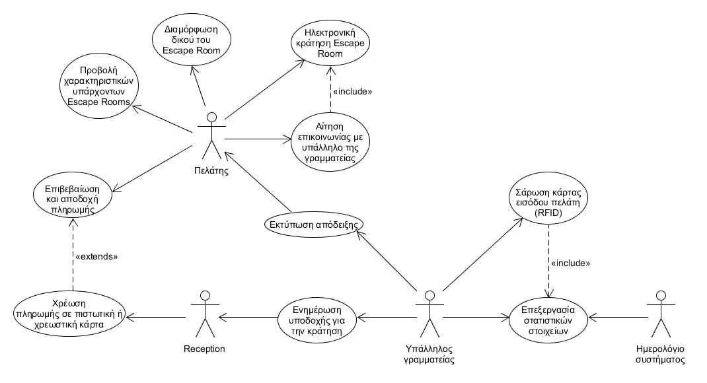

Σύστημα διαχείρισης κρατήσεων Escape Rooms
=======

## R.1. Περιγραφή του πεδίου προβλήματος
 
Από την  **ανάλυση απαιτήσεων** προκύπτουν οι εξής λειτουργικές και ορισμένες 
ειδικές (τροπικές) απαιτήσεις για το _Σύστημα διαχείρισης κρατήσεων Escape Rooms_:

  1. Το σύστημα θα εμφανίζει τα χαρακτηριστικά και την τιμή των υπαρχόντων 
  Escape Rooms.
  2. Το σύστημα θα δίνει τη δυνατότητα στον πελάτη να εξετάσει αναλυτικά τα 
  χαρακτηριστικά του κάθε Escape Room είτε για να το επιλέξει ως έχει, είτε 
  για να προχωρήσει στη διαμόρφωση ενός δικού του Escape Room.
  3. Το σύστημα θα πρέπει να υπολογίζει το κόστος κάθε διαμόρφωσης κατόπιν 
  απαίτησης του πελάτη.
  4. Το σύστημα θα επιτρέπει στον πελάτη να κάνει κράτηση ηλεκτρονικά (online)
   σε ένα Escape Room, ή να ζητήσει από κάποιον υπάλληλο της γραμματείας να 
   επικοινωνήσει μαζί του για να του εξηγήσει τις λεπτομέρειες και τα 
   χαρακτηριστικά του Escape Room και της κράτησης ή να διαπραγματευτεί την 
   τιμή πριν την διενέργεια της κράτησης.
  5. Το σύστημα θα παρέχει στον πελάτη μία φόρμα για να τη συμπληρώσει με σκοπό
   την κράτηση ενός Escape Room, με το όνομα του αρχηγού της ομάδας, τα υπόλοιπα
    μέλη και τα στοιχεία πληρωμής.
  6. Το σύστημα θα υποστηρίζει την κράτηση Escape Room από τον πελάτη, για 
  συγκεκριμένη μέρα και ώρα.
  7. Το σύστημα θα επαληθεύει το επιπτρεπόμενο του πλήθους των μελών για το 
  επιλεγμένο Escape Room και την μέθοδο πληρωμής. 
  8. Το σύστημα θα υποστηρίζει την αποστολή ηλεκτρονικών αιτήσεων από τους 
  υπαλλήλους της γραμματείας με τις λεπτομέρειες κάθε κράτησης, προς στη Reception
   του Escape Room που αυτή αφορά, κατόπιν της καταχώρησης της κράτησης του πελάτη
    στο σύστημα.
  9. Το σύστημα θα προωθεί με e-mail στον πελάτη τα στοιχεία της κράτησης, τα 
   χαρακτηριστικά του Escape Room και τον κωδικό του πελάτη, έτσι ώστε να έχει τη 
   δυνατότητα να ελέγχει ανά πάσα στιγμή την κράτησή του.
  10. Το σύστημα θα επαληθεύει την ταυτότητα του πελάτη πριν την είσοδό του στο 
  χώρο, περνώντας την κάρτα με το τσιπάκι RFID του πελάτη πάνω από τον σαρωτή, 
  καταγράφοντας τους χρόνους εισόδου/εξόδου.
  11. Το σύστημα θα ικανοποιεί αιτήματα του πελάτη για σάρωση της κάρτας εισόδου 
  (RFID) του για ένα συγκεκριμένο Escape Room ώστε να γνωστοποιηθούν η περιγραφή 
  του και το ποσό της χρέωσης για το εν λόγω Escape Room ανά μέλος της ομάδας.
  12. Το σύστημα θα διεκπεραιώνει την πληρωμή του κομίστρου πριν την είσοδό του 
  στο Escape Room, σε μετρητά ή με χρήση κάρτας (χρεωστικής ή πιστωτικής).
  13. Το σύστημα θα ελέγχει αν υπάρχει κράτηση για είσοδο τη δεδομένη μέρα και 
  ώρα, αναγνωρίζει ότι η συναλλαγή μπορεί να προχωρήσει και παρέχει τη δυνατότητα 
  εισόδου στο χώρο και εκτύπωσης της απόδειξης για τον πελάτη.
  14. Το σύστημα θα υπολογίζει, κατά τη λήξη κάθε μήνα, στατιστικά κατάταξης ανά
   Escape Room και στατιστικά κρατήσεων ανά Escape Room.

  
  
Υπό τη μορφή **διαγράμματος περιπτώσεων χρήσης** της UML (`Use
Case Diagram`), οι δράστες και οι περιπτώσεις χρήσης του συστήματος
μοντελοποιούνται ως φαίνεται κάτωθι. Σε περαιτέρω περιγραφή των
περιπτώσεων χρήσης θα προβούμε στην επόμενη έκδοση _R.2. 
Απαιτήσεις λογισμικού / Ανάλυση συστήματος_.

> © 2017-18 Τεχνολογία Λογισμικού, Γεώργιος Μ. Μοσχόβης (3150113), 
 Σταύρος Μαρκόπουλος (3150098)
